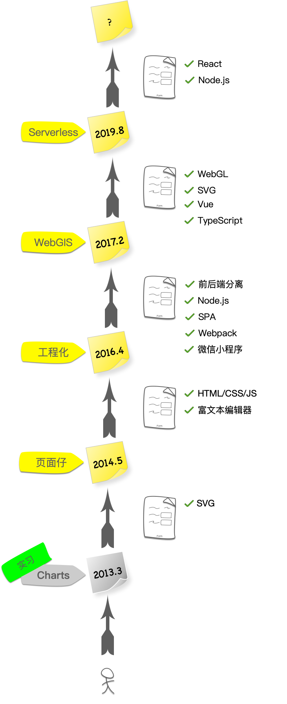

# 前端知识库

此仓库是总结本人自2014年从业以来所涉猎的技术，由于涉及业务场景的差异化以及技术深度的不同，各项技术所罗列细节的仅仅是本人已接触或特别研究过的，不能覆盖所有方面。

此仓库仅当记录，别无他用。

## 技术路线

- 2013年3月读研期间加入SAP上海研究院实习，工作内容主要是基于SVG的Charts library；
- 2014年5月校招加入优酷，前期以写页面为主，后期涉及富文本编辑器；
- 2016年4月加入58到家，精力集中到前端工程化、前后端分离以及少数业务层（H5/小程序）开发；
- 2017年2月加入搜狗地图，大概一半时间聚焦常规Web业务（主要是Vue），一半时间图形编程（SVG/WebGL）；
- 2019年9月加入腾讯，截止到目前的工作内容侧重系统设计，具体涉及技术以React/Node.js为主。

根据以上技术路线，此仓库将重点记录下列几个技术和细节（待完善）。

### 基础知识
基础知识主要集中在HTML5和JavaScript。
#### HTML5
在HTML5的诸多新特性中，我个人曾使用最多涉猎最深入的只有Web Woker：
- 主从多线程模型
- worker线程管理
  - 通信
  - Actor模型
- 安全沙箱

#### JavaScript
JavaScript语言本身的核心难点主要体现在异步以及围绕异步展开的各项延伸：
- 异步
- Generator
- Promise

JavaScript非常灵活，元编程这个词虽然看上去挺陌生，但实际工作中的应用频率非常高：
- 元编程

#### Node.js服务编程
使用Node.js开发Web Server的难点并不仅仅是Node.js本身，首先需要具备一定的服务端开发知识：
- 网络
  - HTTP(S)
  - TCP
  - WebSocket
- 并发&QPS
- 授权
  - OAuth
  - 单点登录
- 消息队列
- 缓存
  - Redis
  - LRU算法
- 安全
  - 加密
    - 对称加密
    - 非对称加密
  - 协议
    - TLS/SSL
  - 攻防
    - XSS
    - CSRF
    - 中间人

然后再结合Node.js本身的特性：
- 异步
  - Promise
  - Event Loop
  - Timmer
  - CLS问题
- 子程序
- 框架
  - Koa
  - Express
- IO
  - Buffer
  - Stream
- 部署
  - 集群
  - 负载均衡
- 监控
  - 守护进程
  - 进程通信
  - CPU负载
- 测试
  - 单元测试
  - 压力测试
  - 基准测试

### 框架
我个人只用过Vue和React：
- Vue
- React

以及相关生态和理论：
- VDOM
- Diff
- Redux
  - Flux
  - Redux Saga

### 工具
从Webpack v1就开始接触，现在已经迭代到v4了：
- Webpack

以及越来越流行的TypeScript：
- TypeScript

### 工程化
- 持续集成
- 监控预警
  - 端侧
  - Node.js
- 性能优化
  - 常规Web项目
  - WebGL
- 日志
- 数据统计

### 图形编程
- WebGL
- SVG

### Serverless
- FaaS

### 行业知识
- WebGIS